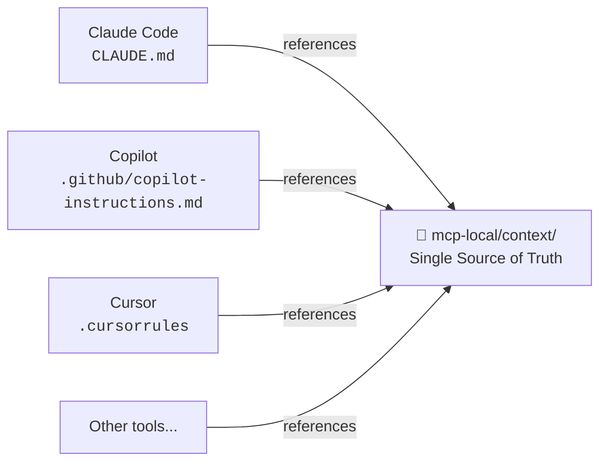

# AI Context Structure — Claude Code

This folder (`.claude/`) contains Claude Code-specific configuration: skills, commands, scripts, and settings.

The **complete AI context** (architectural rules, platform patterns, available skills) lives in a single central location to avoid duplication across tools:

```
📁 mcp-local/context/   ← single source of truth for all AI tools
```

## Why This Structure?

CraftD uses multiple AI coding tools (Claude Code, GitHub Copilot, Cursor, Gemini, Codex). Instead of maintaining separate context files for each tool — which would quickly diverge — all tools point to the same source.



## What Lives Here vs. in mcp-local/context/

| Here (`.claude/`) | In `mcp-local/context/` |
|---|---|
| Claude Code skills (structured YAML format) | Skills as readable Markdown (any tool) |
| Claude Code commands | Architectural rules |
| Claude Code hooks/settings | Platform patterns (Android, iOS, Flutter) |
| Claude-specific scripts | Module graph |

## Quick Reference

- Full rules → `mcp-local/context/rules.md`
- Module dependencies → `mcp-local/context/module-graph.md`
- Platform patterns → `mcp-local/context/android.md`, `ios.md`, `flutter.md`
- Skills (any tool) → `mcp-local/context/skills/`
