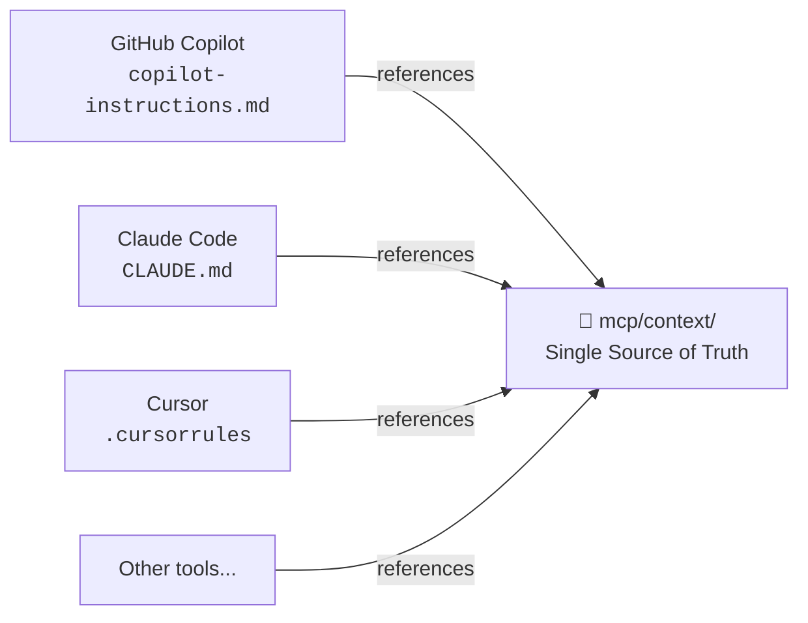

# AI Context Structure — GitHub Copilot

This folder (`.github/`) contains GitHub-specific configuration: workflows, issue templates, and the Copilot native instructions file.

The **complete AI context** (architectural rules, platform patterns, available skills) lives in a single central location to avoid duplication across tools:

```
📁 mcp/context/   ← single source of truth for all AI tools
```

## Why This Structure?

CraftD uses multiple AI coding tools (Claude Code, GitHub Copilot, Cursor, Gemini, Codex). Instead of maintaining separate context files for each tool — which would quickly diverge — all tools point to the same source.



## Files in This Folder

| File | Purpose |
|---|---|
| `copilot-instructions.md` | Copilot native context — critical rules inline + reference to `mcp/context/` |
| `workflows/` | CI/CD automation (build, test, auto-generate tests) |
| `AI_CONTEXT.md` | This file — explains the AI context structure for the community |

## Quick Reference

- Full rules → `mcp/context/rules.md`
- Module dependencies → `mcp/context/module-graph.md`
- Platform patterns → `mcp/context/android.md`, `ios.md`, `flutter.md`
- Skills (any tool) → `mcp/context/skills/`
