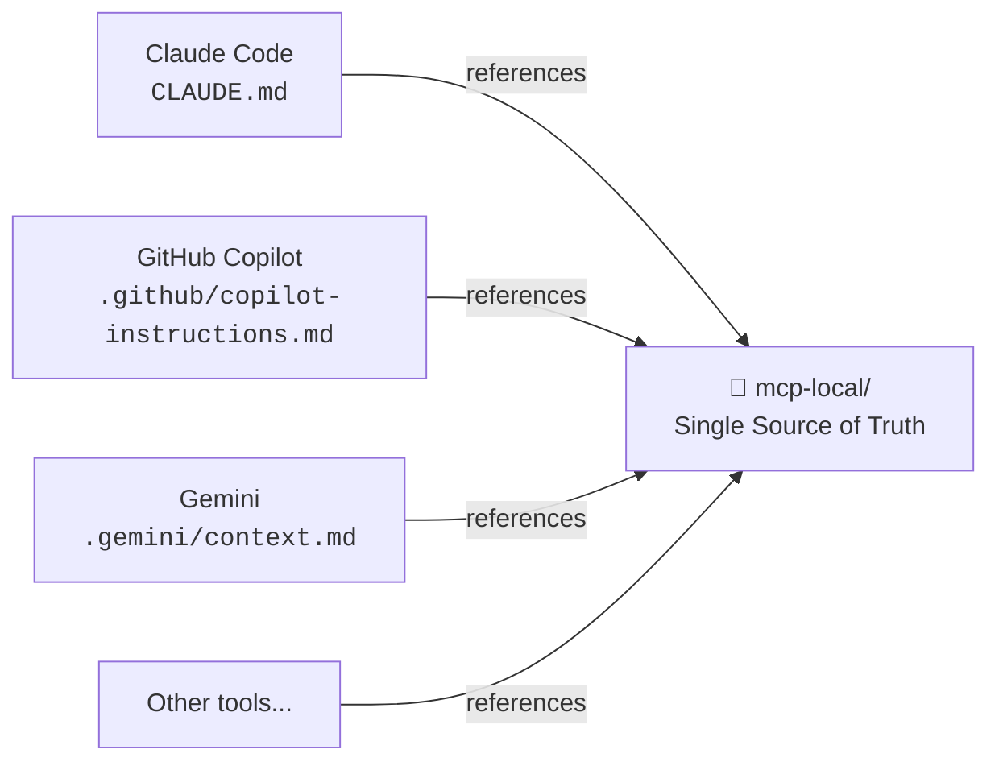

# AI Context Structure

CraftD uses multiple AI coding tools (Claude Code, GitHub Copilot, Gemini, Cursor, etc.). Instead of maintaining separate context files for each tool — which would quickly diverge — all tools point to the same source.

```
📁 mcp-local/   ← single source of truth for all AI tools
```



## mcp-local/ structure

```
mcp-local/
  init.md                 ← initializer: read this first every session
  module-graph.md         ← module dependency graph
  instructions/
    android.md            ← Android/KMP patterns
    ios.md                ← iOS/SwiftUI patterns
    flutter.md            ← Flutter patterns
  skills/
    architecture.md       ← architectural rules and code conventions
    compose-ui.md         ← Compose component checklist and patterns
    android-testing.md    ← Android/KMP testing strategies
    android-gradle-logic.md ← build-logic and version catalog
    new-component.md      ← step-by-step for new components
    review-pr.md          ← PR review checklist
    run-build.md          ← how to run builds per platform
```

## Tool-specific config

| Location | Tool | Purpose |
|---|---|---|
| `CLAUDE.md` | Claude Code | Entry point → points to `mcp-local/` |
| `.gemini/context.md` | Gemini | Entry point → points to `mcp-local/` |
| `.github/copilot-instructions.md` | GitHub Copilot | Entry point → points to `mcp-local/` |
| `.claude/skills/` | Claude Code | Native skills (openspec-propose, apply, explore, archive) |
| `.github/skills/` | GitHub Copilot | Native skills (openspec-propose, apply, explore, archive) |
