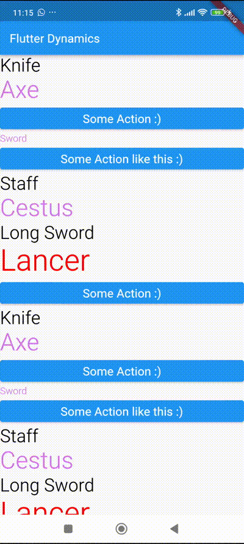

# Welcome to CraftD

## Features

### 🔗 Compatibility

| Tech                       | Support          |
|----------------------------|------------------|
| View System - Android      | ✅ Supported     |
| Jetpack Compose - Android  | ✅ Supported     |
| Widgets Flutter            | ✅ Supported     |
| SwiftUI - iOS              | ✅ Supported     |
| Compose Multiplatform      | ⚒️ In Progress   |

### Components that already exist in the library

| Component         | Android Compose | Android View | Flutter | SwiftUI |
|-------------------|-----------------|--------------|---------|---------|
| Button            |        X        |       X      |    X    |   -     |
| Text              |        X        |       X      |    X    |   X     |
| Checkbox          |        X        |       -      |    -    |   -     |

### How to create a custom component?

- Create a data structure to represent your component:

```kotlin
@JsonIgnoreProperties(ignoreUnknown = true)
@Immutable
@Stable
data class CheckBoxProperties(
    @JsonProperty("text") val text: String? = null,
    ... rest of your properties
)
```

- Add your Component json object in _Dymanic.json_

```json
{
  "key": "CraftDCheckBox",
  "value": {
    ... rest of your properties
  }
}
```

- Create your component:

```kotlin
@Composable
fun CraftDCheckBox(
    checkboxProperties: CheckBoxProperties,
    modifier: Modifier = Modifier,
    onChecked: (Boolean) -> Unit
) {
    ... Rest of your code
}
```

### Screen recordings

<div class="grid cards" markdown>
  <figure markdown="span">
    { width="300" }
    <figcaption>Compose Android</figcaption>
  </figure>

  <figure markdown="span">
    { width="300" }
    <figcaption>View System Android</figcaption>
  </figure>

  <figure markdown="span">
    { width="300" }
    <figcaption>Flutter</figcaption>
  </figure>

  <figure markdown="span">
    { width="300" }
    <figcaption>Swift UI</figcaption>
  </figure>
</div>


!!! info "Credits"

    A Server Driven UI library for Android.
    Inspired by the [_DynamicView_](https://github.com/rviannaoliveira/DynamicView).

