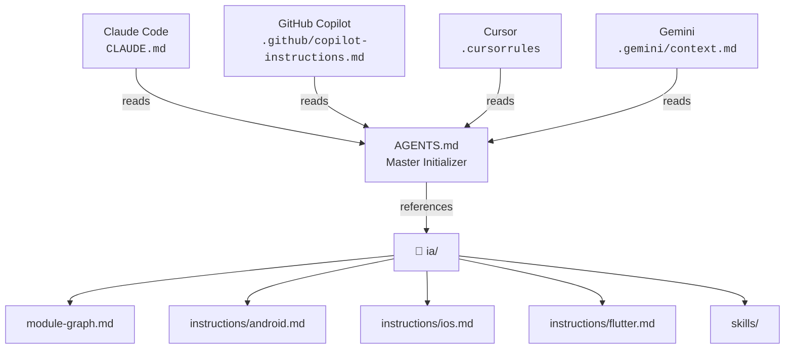

# AI Context — Centralized Source of Truth

This folder contains the **single source of truth** for AI context in the CraftD project.

It is **not** a running MCP Server — it is a collection of Markdown files that any AI tool can read to understand the project's architecture, conventions, and available skills.

## How It Works

`AGENTS.md` (repo root) is the master initializer — all AI tools read it first. This folder provides the detailed context that `AGENTS.md` references.

## Files

| File | Purpose |
|---|---|
| `module-graph.md` | Explicit module dependencies |
| `instructions/android.md` | Android / KMP platform patterns |
| `instructions/ios.md` | iOS / SwiftUI platform patterns |
| `instructions/flutter.md` | Flutter platform patterns |
| `skills/architecture.md` | Architectural rules and code conventions |
| `skills/new-component.md` | How to create a new CraftD component |
| `skills/review-pr.md` | PR review checklist |
| `skills/run-build.md` | How to build and run tests |
| `skills/android-testing.md` | Android/KMP testing strategies |
| `skills/compose-ui.md` | Compose UI best practices |
| `skills/android-gradle-logic.md` | Build-logic and version catalog |

## Replicating This Pattern

This structure can be copied to any public repository as a starting point for centralized AI context:

1. Make `AGENTS.md` the master initializer with full project context
2. Create `ia/` with instructions and skills per platform
3. Create a native file for each AI tool you use — include critical rules inline + point to `AGENTS.md`
4. Add skills as Markdown files with `name`, `description`, and `trigger` frontmatter

The native files ensure basic context even if the tool doesn't follow the `AGENTS.md` reference. The central folder provides complete context for tools that do.
