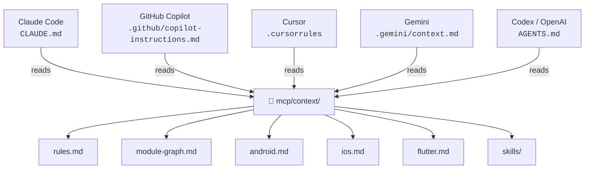

# AI Context — Centralized Source of Truth

This folder contains the **single source of truth** for AI context in the CraftD project.

It is **not** a running MCP Server — it is a collection of Markdown files that any AI tool can read to understand the project's architecture, conventions, and available skills.

## How It Works

Each AI tool reads its own native file (which contains the essential rules inline), and that file points here for the complete context.

## Files

| File | Purpose |
|---|---|
| `context/rules.md` | Architectural rules and code conventions |
| `context/module-graph.md` | Explicit module dependencies |
| `context/android.md` | Android / KMP platform patterns |
| `context/ios.md` | iOS / SwiftUI platform patterns |
| `context/flutter.md` | Flutter platform patterns |
| `context/skills/new-component.md` | How to create a new CraftD component |
| `context/skills/review-pr.md` | PR review checklist |
| `context/skills/run-build.md` | How to build and run tests |
| `context/skills/android-testing.md` | Android/KMP testing strategies |
| `context/skills/compose-ui.md` | Compose UI best practices |

## Replicating This Pattern

This structure can be copied to any public repository as a starting point for centralized AI context:

1. Create `mcp/context/` with your project's rules and platform patterns
2. Create a native file for each AI tool you use (see examples in this repo)
3. Each native file: include critical rules inline + point to `mcp/context/` for details
4. Add skills as Markdown files with `name`, `description`, and `trigger` frontmatter

The native files ensure basic context even if the tool doesn't follow the `mcp/context/` reference. The central folder provides complete context for tools that do.
